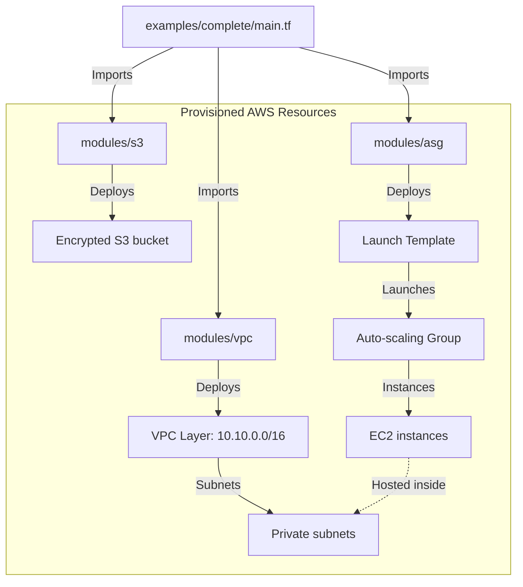

# Reusable AWS IaC Terraform Modules

A collection of security-hardened, reusable, and composable Terraform modules to automate cloud provisioning on Amazon Web Services (AWS) using Infrastructure as Code (IaC) best practices.

---

## 📊 Architecture & Workflows

Below is the dependency layout showing how the complete integration example imports and orchestrates the VPC, S3, and ASG modules:



---

## 💡 What We Will Learn in This Repo

By studying and implementing these modules, you will learn how to:
- **Build Composable Modules**: Structure Terraform code into isolated components with clear inputs (`variables.tf`) and outputs (`outputs.tf`).
- **Enforce Security Boundaries**: Deploy private EC2 compute instances within isolated subnets, eliminating public exposure.
- **Implement Server-Side Encryption**: Configure S3 buckets with default AES-256 encryption policies and public access blocks.
- **Manage Autoscaling Lifecycles**: Structure EC2 Launch Templates to launch scaled compute instances automatically based on capacity constraints.
- **Configure Multi-Tier Networks**: Segment network blocks dynamically using HCL cidrsubnet functions.

---

## 📖 Step-by-Step Implementation Guide

Follow these steps to deploy resources using the integration example:

### 1. Prerequisite Installations
Verify you have the following installed:
- [Terraform](https://developer.hashicorp.com/terraform/downloads) (v1.5.0+)
- [AWS CLI](https://aws.amazon.com/cli/) (authenticated with permissions to provision VPC, EC2, and S3 resources)

### 2. Navigate to Example Directory
Clone the repository and move to the complete example subfolder:
```bash
git clone https://github.com/Pradeeptalari14/terraform-aws-modules.git
cd terraform-aws-modules/examples/complete
```

### 3. Initialize Workspace
Initialize the local working directory to download providers and setup module dependencies:
```bash
terraform init
```

### 4. Review Provision Plan
Generate the execution plan to see exactly what AWS resources will be created:
```bash
terraform plan
```

### 5. Provision Resources
Apply the configuration to provision the VPC, S3 bucket, and ASG in your AWS account:
```bash
terraform apply -auto-approve
```

---

## 🔄 Things You Need to Replace (Customization Checklist)

Before executing `terraform apply` in the example directory, customize these values:
- **S3 Bucket Name**: In `examples/complete/main.tf` (line 16), replace `sutter-health-pipeline-artifacts-bucket` with a unique name, as AWS S3 bucket names are globally unique.
- **AMI ID**: In `examples/complete/main.tf` (line 22), update `ami-0c7217cdde317cfec` with a valid Amazon Linux 2 AMI ID for your target AWS region.
- **Security Groups**: In `examples/complete/main.tf` (line 25), update `sg-09ab87c6d5e4f3a2` to match an active security group inside your target VPC space.

---

## 🛠️ Useful Commands (Project-Specific Reference)

```bash
# Auto-format HCL style layout files
terraform fmt -recursive

# Validate syntax and parameters correctness
terraform validate

# Inspect proposed resource changes
terraform plan

# Apply changes to provision resources
terraform apply -auto-approve

# Teardown and delete all provisioned resources
terraform destroy -auto-approve
```

---

## 🔗 References & Guides
- **Portfolio Website**: [talaripradeep.info](https://talaripradeep.info/)
- **DevOps Console Hub**: [talaripradeep.info/tools/](https://talaripradeep.info/tools/)
- **Live Guide**: [talaripradeep.info/tools/terraform/index.html](https://talaripradeep.info/tools/terraform/index.html)
